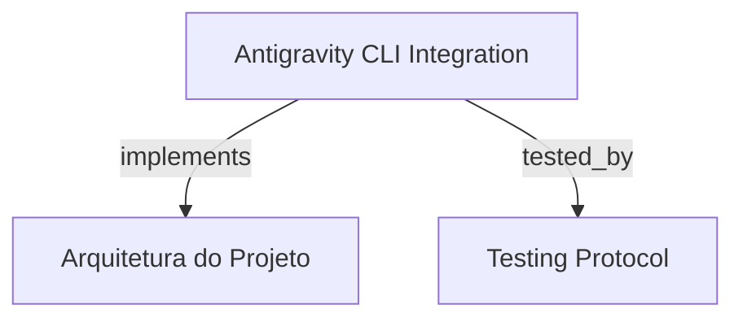

# Antigravity CLI Integration

Validação e integração do Google Antigravity CLI (`agy`) para orquestração autônoma de subagentes com entrega de prompt via stdin, parsing estruturado de JSON, preservação de sessão e terminação de árvore de processos.

```graph
{
  "node_id": "feature:antigravity-cli-validation",
  "domain": "antigravity_cli_validation",
  "implements": ["adr:architecture"],
  "tested_by": ["adr:tests"],
  "entrypoints": [
    "sdk/src/agent-runner/antigravity-cli/AntigravityCLIRunner.ts"
  ],
  "registration_files": [
    "sdk/src/agent-runner/AgentRunnerFactory.ts"
  ],
  "reference_files": [],
  "code_files": [
    "sdk/src/agent-runner/AbstractCliRunner.ts",
    "sdk/src/agent-runner/AgentRunnerError.ts",
    "sdk/src/agent-runner/AgentRunnerRegistry.ts",
    "sdk/src/agent-runner/CliRunnerProgress.ts",
    "sdk/src/agent-runner/IAgentRunner.ts",
    "sdk/src/agent-runner/types.ts"
  ],
  "test_files": [
    "sdk/src/agent-runner/__tests__/AntigravityCLIRunner.integration.test.ts",
    "sdk/src/agent-runner/__tests__/AntigravityCLIRunner.test.ts",
    "sdk/src/agent-runner/__tests__/EnvFiltering.test.ts"
  ]
}
```

## OVERVIEW
Implementa o runner especializado `AntigravityCLIRunner` para execução autônoma do Google Antigravity CLI (`agy`). Suporta entrega segura de prompts longos via stream `stdin`, isolamento e extração resiliente de saídas JSON, mapeamento de métricas de tokens e continuidade de conversação multi-turn.

## FOLDER STRUCTURE
<folder_structure>
```
sdk/src/agent-runner/
├── antigravity-cli/              # Runner especializado para Google Antigravity CLI (agy)
├── __tests__/                    # Suítes de testes unitários herméticos e integração ao vivo
├── AbstractCliRunner.ts          # Classe base de gerenciamento de processos e sinais
├── AgentRunnerError.ts           # Definição e classificação de erros de execução
├── AgentRunnerFactory.ts         # Fábrica de inicialização e injeção de dependências de runners
└── AgentRunnerRegistry.ts        # Registro idempotente de runners disponíveis
```
</folder_structure>

## KEY MECHANISMS

### Stdin Prompt Delivery
- **Entrega de payload via stdin**: Define `writePromptToStdin = true` para transmitir prompts extensos via pipe `stdin`, prevenindo estouro de limites de linha de comando (`ARG_MAX`) do sistema operacional.
- **Flags de Execução**: Configura `--output-format json`, `--print-timeout`, `--dangerously-skip-permissions`, `--agent <name>` e flags repetíveis `--add-dir <path>`.

### Resilient Output Extraction & Error Recovery
- **Extração de JSON**: Tenta parse primário do payload de saída JSON; em caso de logs intercalados, aplica fallback via `extractJsonOrNull`.
- **Recuperação de Tool Warning**: Se o status for `ERROR` mas contiver resposta textual válida, a execução conclui com sucesso para permitir auto-recuperação do agente.
- **Tratamento de Quota**: Mapeia falhas com padrões de rate limit ou saturação de modelo diretamente para `AgentRunnerErrorCode.QUOTA_EXCEEDED`.

### Session Continuity & Token Accounting
- **Conversação Multi-Turn**: Preserva e propaga o identificador de sessão através da flag `--conversation <sessionId>`.
- **Normalização de Métricas**: Mapeia `input_tokens`, `output_tokens`, `cache_read_tokens` e custo estimado em USD para o formato unificado `TokenUsage`.

## HOW TO CONFIGURE AND DISPATCH

### Prerequisites
1. Binário `agy` acessível no `PATH` do ambiente de execução (ou mock de processo em testes).
2. Registro do runner ativo em `AgentRunnerRegistry`.

### Steps
1. Instanciar `AntigravityCLIRunner` ou resolver via `AgentRunnerFactory.create(Runner.ANTIGRAVITY_CLI)`.
2. Invocar o método `run()` passando o envelope `AgentInvocation`.

<code_example>
# CORRECT: Despachar invocação com sessão e diretórios adicionais
const output = await runner.run({
  agent: 'developer-backend',
  mode: 'autonomous',
  prompt: 'Execute TDD implementation',
  session: { id: 'conv-1234' },
  additionalDirs: ['/workspace/skills'],
  timeoutMs: 60000,
})

# WRONG: Passar prompt diretamente na lista de argumentos CLI
spawn('agy', ['--prompt', promptText]) // WRONG: excede limites de ARG_MAX e ignora protocolo
</code_example>

## PARAMETERS / CONFIGURATIONS

| Parameter | Type | Required | Description | Default |
|-----------|------|----------|-------------|---------|
| `agent` | string | Yes | Identificador do agente/persona especializado | — |
| `mode` | 'autonomous' | 'default' | Yes | Modo de execução do runner | 'autonomous' |
| `prompt` | string | No | Conteúdo do prompt enviado via stdin | Derivado de payload |
| `session` | AgentSession | No | Sessão ativa para conversações multi-turn (`--conversation`) | — |
| `additionalDirs` | string[] | No | Diretórios de ferramentas e skills montados via `--add-dir` | `[]` |
| `timeoutMs` | number | No | Tempo limite em milissegundos para término do processo | 300000 |

## BEST PRACTICES
REQUIRED: Usar `writePromptToStdin = true` para qualquer prompt de agente externo executado via CLI.
REQUIRED: Higienizar o ambiente de processo com `filterSensitiveEnv` para impedir vazamento de credenciais.
FORBIDDEN: Disparar processos filhos desvinculados de manipuladores de cancelamento em árvore de processos (`taskkill` no Windows e `SIGKILL` de grupo no POSIX).

## DOCUMENT MAP



## REFERENCES

- [**ARCHITECTURE.md**](../adr/ARCHITECTURE.md): Arquitetura do módulo de runners e contratos de execução.
- [**TESTS.md**](../adr/TESTS.md): Estratégia de testes herméticos e testes de integração com agy.
