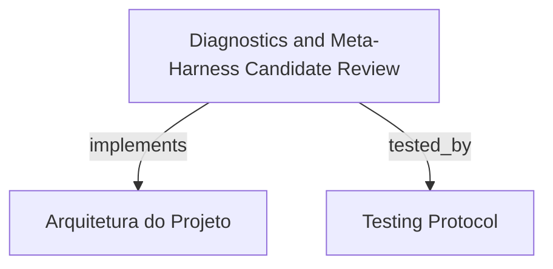

# Diagnostics and Meta-Harness Candidate Review

Interface visual para diagnóstico de sessões e revisão de candidatos do Meta-Harness (espelhando `hrns diagnose` e `hrns candidate`), oferecendo análise de traces de histórico, processamento em lote de sessões pendentes e visualização de diffs de prompts otimizados.

```graph
{
  "node_id": "feature:diagnostics-candidate-review",
  "domain": "diagnostics_candidate_review",
  "implements": ["adr:architecture"],
  "tested_by": ["adr:tests"],
  "entrypoints": [
    "sdk-web/src/components/diagnostics/DiagnosticsDashboard.ts",
    "sdk-web/src/components/candidates/CandidateList.ts"
  ],
  "registration_files": [
    "sdk-web/src/server/routes/diagnosticsRoutes.ts"
  ],
  "reference_files": [
    "sdk-web/src/hooks/useDiagnostics.ts",
    "sdk-web/src/hooks/useCandidates.ts"
  ],
  "code_files": [
    "sdk-web/src/api/diagnosticsApi.ts",
    "sdk-web/src/components/candidates/CandidateDetailModal.ts",
    "sdk-web/src/components/diagnostics/BatchExecutionPanel.ts",
    "sdk-web/src/server/controllers/DiagnosticsController.ts"
  ],
  "test_files": [
    "sdk-web/src/api/__tests__/diagnosticsApi.spec.ts",
    "sdk-web/src/components/candidates/__tests__/CandidateList.spec.ts",
    "sdk-web/src/components/diagnostics/__tests__/DiagnosticsDashboard.spec.ts",
    "sdk-web/src/hooks/__tests__/useDiagnostics.spec.ts",
    "sdk-web/src/server/__tests__/diagnosticsRoutes.spec.ts"
  ]
}
```

## OVERVIEW
Permite inspecionar o histórico de execução de agentes, detectar padrões recorrentes de falha e gerenciar as otimizações contínuas de prompts propostas pelo Meta-Harness. Oferece visualização em lote de sessões no ledger (`diagnose-sessions.jsonl`) e painel detalhado de candidatos com diffs visuais e status de promoção.

## FOLDER STRUCTURE
<folder_structure>
```
sdk-web/src/
├── api/                          # diagnosticsApi para comunicação HTTP
├── components/diagnostics/       # DiagnosticsDashboard e BatchExecutionPanel
├── components/candidates/        # CandidateList e CandidateDetailModal
├── hooks/                        # useDiagnostics e useCandidates
└── server/                       # DiagnosticsController e rotas REST
```
</folder_structure>

## KEY MECHANISMS

### Session Ledger & Batch Processing
- **Ledger de Sessões**: Lê o arquivo `diagnose-sessions.jsonl` para apresentar o estado das execuções (`pending`, `processed`).
- **Processamento em Lote**: Executa o ciclo de diagnóstico em lotes de sessões acumuladas, disparando a análise do Meta-Harness.

### Candidate Review & Diff Inspection
- **Catálogo de Candidatos**: Lista todas as propostas de mutação de skills salvas em `docs/harness-history/candidates/`.
- **Visualizador de Diffs**: Exibe alterações de prompts com destaque visual para inclusões, remoções e justificativa técnica da evolução.
- **Ciclo de Vida**: Acompanha o status de cada candidato (`PROPOSED`, `APPLIED`, `PROMOTED`).

## HOW TO CONFIGURE AND DISPATCH

### Prerequisites
1. Traces de histórico registrados em `docs/harness-history/traces/`.
2. SDK server ativo com rotas de diagnóstico habilitadas.

### Steps
1. Navegar até a aba de Diagnóstico ou Candidatos na interface web.
2. Disparar processamento em lote ou inspecionar detalhes do candidato selecionado.

<code_example>
# CORRECT: Consulta de candidatos via cliente tipado
const candidates = await diagnosticsApi.listCandidates({ workspacePath });
const details = await diagnosticsApi.getCandidateById(candidates[0].id);

# WRONG: Manipular arquivos de histórico sem passar pelo ledger
fs.unlinkSync('docs/harness-history/candidates/cand-1.json'); // WRONG: corrompe consistência do histórico
</code_example>

## PARAMETERS / CONFIGURATIONS

| Parameter | Type | Required | Description | Default |
|-----------|------|----------|-------------|---------|
| `batchSize` | number | No | Tamanho do lote de sessões para processamento | 3 |
| `autoPromote` | boolean | No | Flag para promoção automática de candidatos aceitos | false |
| `workspacePath` | string | Yes | Diretório raiz do projeto | process.cwd() |

## BEST PRACTICES
REQUIRED: Preservar a atomicidade na transição de status de sessões no ledger de diagnóstico.
REQUIRED: Exibir diffs completos de prompts antes de qualquer ação de promoção manual.
FORBIDDEN: Modificar traces históricos diretamente durante a visualização em UI.

## DOCUMENT MAP



## REFERENCES

- [**ARCHITECTURE.md**](../adr/ARCHITECTURE.md): Camada de telemetria e otimização do harness.
- [**TESTS.md**](../adr/TESTS.md): Estratégia de testes de diagnóstico e API de candidatos.
