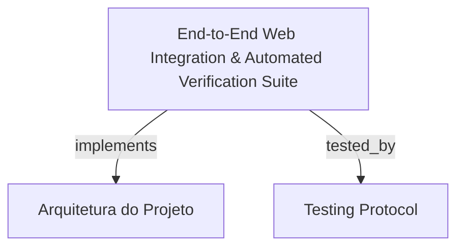

# End-to-End Web Integration & Automated Verification Suite

Suíte completa de testes de ponta a ponta (E2E) e validação automatizada para o HarnessKit Web (`sdk-web`), cobrindo workflows de orquestração, streaming SSE, rejeição de concorrência multi-aba (HTTP 409), resiliência a reconexões e conformidade de acessibilidade (WCAG AA).

```graph
{
  "node_id": "feature:e2e-web-validation",
  "domain": "e2e_web_validation",
  "implements": ["adr:architecture"],
  "tested_by": ["adr:tests"],
  "entrypoints": [
    "sdk-web/test/e2e/orchestration-workflow.e2e.ts"
  ],
  "registration_files": [],
  "reference_files": [
    "sdk-web/test/e2e/multi-tab-resilience.e2e.ts",
    "sdk-web/test/e2e/theme-a11y.e2e.ts"
  ],
  "code_files": [
    "sdk-web/test/e2e/feature-views.e2e.ts"
  ],
  "test_files": [
    "sdk-web/test/e2e/feature-views.e2e.ts",
    "sdk-web/test/e2e/multi-tab-resilience.e2e.ts",
    "sdk-web/test/e2e/orchestration-workflow.e2e.ts",
    "sdk-web/test/e2e/theme-a11y.e2e.ts"
  ]
}
```

## OVERVIEW
Garante a qualidade de ponta a ponta de todas as interações do `sdk-web` com o servidor backend e o runtime de agentes. Executa cenários herméticos em sandboxes efêmeras no `os.tmpdir()`, valida a máquina de estados, o isolamento de concorrência com lock em workspace e a acessibilidade visual dos componentes Itaú.

## FOLDER STRUCTURE
<folder_structure>
```
sdk-web/test/e2e/
├── feature-views.e2e.ts          # Testes de navegação e integração de rotas (/settings, /reports, /diagnose)
├── multi-tab-resilience.e2e.ts   # Conflito de concorrência (HTTP 409) e reconexão de abas
├── orchestration-workflow.e2e.ts # Fluxo completo de run, logs SSE e abort
└── theme-a11y.e2e.ts             # Auditoria de contraste WCAG AA e alternância de temas
```
</folder_structure>

## KEY MECHANISMS

### Ephemeral Sandbox & Process Lifecycle
- **Isolamento Total**: Provisiona diretórios temporários descartáveis para evitar modificação no repositório real do desenvolvedor.
- **Teardown Recursivo de Processos**: Encerra árvores completas de subprocessos ao término de cada suíte de teste.

### Multi-Tab Concurrency & Reconnection Verification
- **Garantia de Lock Unificado**: Valida que uma segunda aba tentando disparar um job simultâneo no mesmo workspace recebe HTTP 409 Conflict.
- **Reconexão Transparente**: Comprova que fechar ou recarregar a aba não cancela a execução em background e restaura os logs via SSE.

### Automated A11y & Contrast Auditing
- **Auditoria WCAG AA**: Utiliza axe-core e validações de contraste em tempo de execução para verificar proporções >= 4.5:1 nas paletas Itaú (claro e escuro).

## HOW TO CONFIGURE AND DISPATCH

### Prerequisites
1. Node.js e dependências instaladas no monorepo.
2. Binários do Vitest configurados para rodar suítes E2E.

### Steps
1. Executar os testes E2E através do runner de testes.

<code_example>
# CORRECT: Executar suíte completa de testes E2E do sdk-web
npm run test:e2e

# WRONG: Executar testes de integração com workspace compartilhado não isolado
runTestsInCurrentDirectory(); // WRONG: polui repositório com arquivos de teste
</code_example>

## PARAMETERS / CONFIGURATIONS

| Parameter | Type | Required | Description | Default |
|-----------|------|----------|-------------|---------|
| `timeoutMs` | number | No | Timeout global para passos de teste E2E | 30000 |
| `headless` | boolean | No | Execução de browser em modo headless | true |

## BEST PRACTICES
REQUIRED: Usar seletores baseados em ARIA e acessibilidade (role, aria-label) para manter testes resilientes a mudanças de layout.
REQUIRED: Limpar completamente os diretórios de sandbox efêmeros no hook de teardown.
FORBIDDEN: Usar delays de tempo fixos (sleep) em vez de asserções orientadas a eventos e seletores assíncronos.

## DOCUMENT MAP



## REFERENCES

- [**ARCHITECTURE.md**](../adr/ARCHITECTURE.md): Padrões de arquitetura e isolamento de runtime.
- [**TESTS.md**](../adr/TESTS.md): Comandos e protocolos de teste unitário e E2E.
