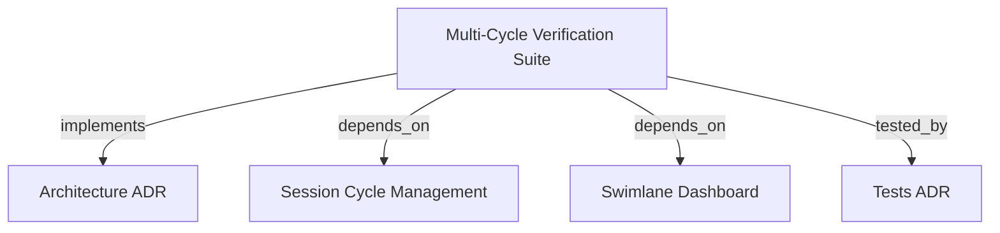

# Multi-Cycle Orchestration & Session Reuse Automated Verification Suite

Provides automated end-to-end integration and stress test suites verifying session ID retention, atomic multi-manifest persistence, process tree termination, and live swimlane UI synchronization.

```graph
{
  "node_id": "feature:multi-cycle-verification",
  "domain": "multi_cycle_verification",
  "implements": ["adr:architecture"],
  "tested_by": ["adr:tests"],
  "entrypoints": [
    "sdk/src/test-fixtures/MultiCycleTestHarness.ts"
  ],
  "registration_files": [],
  "reference_files": [
    "sdk/src/__tests__/e2e/MultiCycleSessionLifecycle.e2e.spec.ts"
  ],
  "code_files": [],
  "test_files": [
    "sdk/src/test-fixtures/__tests__/MultiCycleTestHarness.spec.ts",
    "sdk/src/__tests__/e2e/MultiCycleSseResumption.e2e.spec.ts",
    "sdk/src/__tests__/e2e/ProcessTreeTermination.e2e.spec.ts",
    "sdk-web/src/__tests__/e2e/SwimlaneDashboardIntegration.e2e.spec.ts"
  ]
}
```

## OVERVIEW

The Multi-Cycle Verification Suite provides high-order integration guarantees across the entire autonomous orchestration stack. It exercises sequential and concurrent cycle dispatches under the same session ID, audits OS process tables for zero zombie runners after aborts, verifies SSE stream multiplexing, and confirms full state recoverability without browser-driver overhead.

## FOLDER STRUCTURE

<folder_structure>
```
sdk/src/
├── test-fixtures/          # MultiCycleTestHarness (sandbox isolation & mock routes)
└── __tests__/e2e/          # MultiCycleSessionLifecycle, MultiCycleSseResumption, ProcessTreeTermination
sdk-web/src/
└── __tests__/e2e/          # SwimlaneDashboardIntegration
```
</folder_structure>

## MAIN CONCEPTS & COMPONENTS

- **MultiCycleTestHarness**: Reusable test fixture provisioning temporary workspace directories in `os.tmpdir()`, spinning up ephemeral Node HTTP servers, and performing recursive teardowns.
- **Session Reuse Verification**: Integration tests confirming that multiple consecutive cycles attach to a single `SessionId` without overwriting or corrupting individual cycle manifests.
- **Process Leak Auditor**: Automated check verifying that child runner CLI processes and subprocess trees are completely killed upon abort on both Windows and POSIX platforms.
- **SSE Multiplexing & Resumption Validator**: Tests continuous event delivery across concurrent cycles and confirms cycle resumption from saved phase snapshots.

## HOW TO RUN MULTI-CYCLE E2E TESTS

### Prerequisites
1. Node.js >= 18 installed.
2. Dependencies installed in workspace.

### Steps
1. Execute backend E2E suites:
   `npm.cmd test -- src/__tests__/e2e/`
2. Execute frontend integration suite:
   `npm.cmd --prefix sdk-web test -- src/__tests__/e2e/`

<code_example>
# CORRECT: Run complete multi-cycle verification suites
npm.cmd test -- src/__tests__/e2e/MultiCycleSessionLifecycle.e2e.spec.ts

# WRONG: Running tests without temporary sandbox isolation
const repo = new FileSessionRepository(process.cwd()) // Pollutes active project!
</code_example>

## PARAMETERS / CONFIGURATIONS

| Name | Type | Required | Description | Default |
|------|------|----------|-------------|---------|
| AGY_INTEGRATION_TEST | boolean | No | Flag enabling live subprocess execution against physical tools | false |

## BEST PRACTICES

REQUIRED: Sandbox Isolation — Always use `MultiCycleTestHarness` to isolate disk writes in unique temporary directories.  
REQUIRED: Ephemeral Sockets — Always bind test HTTP servers to port `0` for dynamic, collision-free OS port allocation.  
FORBIDDEN: Lingering Sockets — Always invoke `server.closeAllConnections()` and `server.close()` during test teardown.

## DOCUMENT MAP



## REFERENCES

- [**ARCHITECTURE.md**](../adr/ARCHITECTURE.md): Multi-process supervision and Clean Architecture boundaries.
- [**session-cycle-management.md**](./session-cycle-management.md): Core session repository and lifecycle use cases.
- [**swimlane-cycle-dashboard.md**](./swimlane-cycle-dashboard.md): Frontend timeline and lane presentation.
- [**TESTS.md**](../adr/TESTS.md): Vitest test protocols and coverage criteria.
