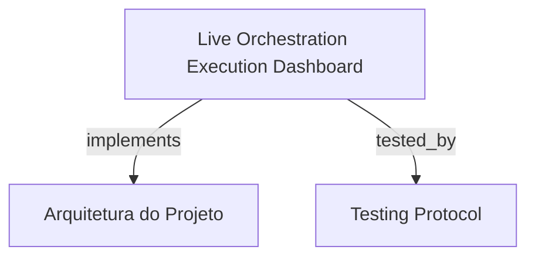

# Live Orchestration Execution Dashboard

Painel de controle em tempo real para execução do loop autônomo de TDD (espelhando `hrns run`), com seleção de runners, configuração de modelos, streaming bidirecional de logs ANSI via Server-Sent Events (SSE), telemetria ao vivo e steering interativo mid-run.

```graph
{
  "node_id": "feature:orchestration-execution",
  "domain": "orchestration_execution",
  "implements": ["adr:architecture"],
  "tested_by": ["adr:tests"],
  "entrypoints": [
    "sdk-web/src/views/orchestrator/OrchestrationDashboardView.ts",
    "sdk/src/server/adapters/inbound/http/routes/EventStreamHandler.ts"
  ],
  "registration_files": [
    "sdk/src/server/adapters/outbound/services/JobExecutionRegistry.ts"
  ],
  "reference_files": [
    "sdk-web/src/hooks/useOrchestrationExecution.ts",
    "sdk-web/src/services/EventStreamClient.ts"
  ],
  "code_files": [
    "sdk-web/src/hooks/useSteering.ts",
    "sdk-web/src/services/OrchestrationApiClient.ts",
    "sdk-web/src/utils/ansiParser.ts",
    "sdk-web/src/views/orchestrator/RunnerConfigCard.ts",
    "sdk-web/src/views/orchestrator/components/AbortConfirmModal.ts",
    "sdk-web/src/views/orchestrator/components/LiveLogConsole.ts",
    "sdk-web/src/views/orchestrator/components/PhaseTimeline.ts",
    "sdk-web/src/views/orchestrator/components/RunnerSelector.ts",
    "sdk-web/src/views/orchestrator/components/SteeringDrawer.ts",
    "sdk-web/src/views/orchestrator/components/TelemetryCards.ts",
    "sdk/src/server/application/use-cases/AbortOrchestrationJobUseCase.ts",
    "sdk/src/server/application/use-cases/ApplyMidRunSteeringUseCase.ts"
  ],
  "test_files": [
    "sdk-web/src/hooks/__tests__/useOrchestrationExecution.spec.ts",
    "sdk-web/src/hooks/__tests__/useSteering.spec.ts",
    "sdk-web/src/utils/__tests__/ansiParser.spec.ts",
    "sdk-web/src/views/orchestrator/__tests__/LiveLogConsole.spec.ts",
    "sdk-web/src/views/orchestrator/__tests__/OrchestrationDashboardView.spec.ts",
    "sdk-web/src/views/orchestrator/__tests__/PhaseTimeline.spec.ts",
    "sdk-web/src/views/orchestrator/__tests__/RunnerConfigCard.spec.ts",
    "sdk-web/src/views/orchestrator/__tests__/SteeringDrawer.spec.ts",
    "sdk/src/server/adapters/inbound/http/routes/__tests__/EventStreamHandler.spec.ts",
    "sdk/src/server/application/use-cases/__tests__/AbortOrchestrationJobUseCase.test.ts",
    "sdk/src/server/application/use-cases/__tests__/ApplyMidRunSteeringUseCase.test.ts"
  ]
}
```

## OVERVIEW
Fornece governança e observabilidade em tempo real para o ciclo autônomo de orquestração. Conecta a interface web via SSE para receber atualizações instantâneas de fases, delta de tokens e logs formatados com suporte a temas Itaú, além de possibilitar intervenções (steering, rollbacks, abort) sem interromper a integridade do processo de fundo.

## FOLDER STRUCTURE
<folder_structure>
```
sdk-web/src/
├── views/orchestrator/           # OrchestrationDashboardView e subcomponentes
├── services/                     # OrchestrationApiClient e EventStreamClient
├── hooks/                        # useOrchestrationExecution e useSteering
└── utils/                        # ansiParser com suporte a tema Itaú
sdk/src/server/
├── adapters/inbound/http/routes/ # EventStreamHandler (SSE)
├── adapters/outbound/services/   # JobExecutionRegistry
└── application/use-cases/        # AbortOrchestrationJobUseCase e ApplyMidRunSteeringUseCase
```
</folder_structure>

## KEY MECHANISMS

### Real-Time SSE Event Broadcasting & Log Streaming
- **Broadcasting Multi-Cliente**: O `EventStreamHandler` transmite eventos de pipeline (fase, progresso, métricas de tokens e logs de stdout/stderr) para todas as abas conectadas.
- **Parsing ANSI Colorizado**: O utilitário `ansiParser` converte códigos de escape de terminal em spans HTML respeitando as variáveis de tema claro e escuro.

### Mid-Run Steering & Control Actions
- **Injeção Dinâmica de Regras**: Permite ao desenvolvedor injetar restrições ou instruções mid-run através do `SteeringDrawer` sem reiniciar o job.
- **Rollback de Fase e Abort**: Suporta reversão de etapas e cancelamento explícito via encerramento recursivo de processos filhos (`taskkill` no Windows e `SIGKILL` no POSIX).

### Workspace Lock & Reconnection Resilience
- **Lock Exclusivo**: Garante apenas um job ativo por workspace (retornando HTTP 409 em tentativas simultâneas).
- **Sobrevivência a Reload**: Recarrega o estado atual e buffer de logs ao reconectar abas do navegador sem afetar a execução em background.

## HOW TO CONFIGURE AND DISPATCH

### Prerequisites
1. SDK Server ativo escutando requisições REST e SSE.
2. Agente runner instalado ou mockado no ambiente de execução.

### Steps
1. Configurar runner, modelo e modo na interface web.
2. Iniciar o job e acompanhar o streaming de logs e transições de fase.

<code_example>
# CORRECT: Conexão resiliente a SSE com reconexão automática
const streamClient = new EventStreamClient(baseUrl, jobId);
streamClient.on('log', (chunk) => console.log(chunk));
streamClient.connect();

# WRONG: Polling contínuo via HTTP para logs
setInterval(() => fetch('/api/logs'), 1000); // WRONG: causa sobrecarga e atraso de telemetria
</code_example>

## PARAMETERS / CONFIGURATIONS

| Parameter | Type | Required | Description | Default |
|-----------|------|----------|-------------|---------|
| `runner` | string | Yes | Identificador do agente runner selecionado | 'antigravity-cli' |
| `mode` | 'quick' | 'fast' | 'thinking' | 'deep_thinking' | No | Perfil de execução do pipeline | 'thinking' |
| `workspacePath` | string | Yes | Caminho absoluto do projeto em execução | process.cwd() |

## BEST PRACTICES
REQUIRED: Manter buffer circular de eventos SSE para replay imediato durante reconexões de cliente web.
REQUIRED: Encerrar toda a árvore de processos ao solicitar abort para evitar agentes órfãos consumindo recursos.
FORBIDDEN: Bloquear a fila de execução em operações síncronas de escrita em disco.

## DOCUMENT MAP



## REFERENCES

- [**ARCHITECTURE.md**](../adr/ARCHITECTURE.md): Arquitetura de mensageria assíncrona e runners.
- [**TESTS.md**](../adr/TESTS.md): Estratégia de testes de SSE e cancelamento de jobs.
