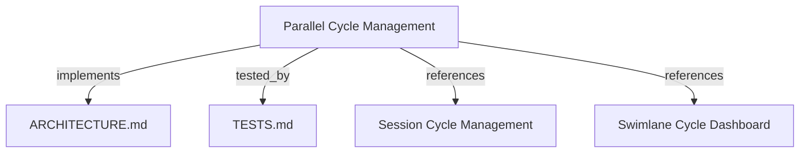

# Parallel Cycle Management with Dedicated 1:1 Sessions

Orquestração concorrente de múltiplos ciclos autônomos simultâneos, mapeando estritamente cada ciclo para seu próprio ID de sessão e isolado em Git Worktrees.

```graph
{
  "node_id": "feature:parallel-cycle-management",
  "domain": "parallel_cycle_management",
  "implements": ["adr:architecture"],
  "tested_by": ["adr:tests"],
  "entrypoints": [
    "sdk/src/server/adapters/inbound/http/routes/ParallelCycleRoutes.ts",
    "sdk-web/src/views/orchestrator/components/ParallelCycleModal.ts"
  ],
  "registration_files": [
    "sdk/src/server/adapters/inbound/http/routes/RouteHandlers.ts",
    "sdk/src/server/domain/aggregates/index.ts"
  ],
  "reference_files": [
    "sdk/src/server/domain/aggregates/AutonomousCycleSession.ts",
    "sdk/src/server/adapters/outbound/services/WorktreeIsolationProvider.ts"
  ],
  "code_files": [
    "sdk/src/server/domain/aggregates/AutonomousCycleSession.ts",
    "sdk/src/server/adapters/outbound/services/WorktreeIsolationProvider.ts",
    "sdk/src/server/application/use-cases/ParallelCycleCoordinator.ts",
    "sdk/src/server/adapters/inbound/http/routes/ParallelCycleRoutes.ts",
    "sdk-web/src/views/orchestrator/components/ParallelCycleModal.ts",
    "sdk/src/server/adapters/inbound/http/web/WebUiRenderer.ts"
  ],
  "test_files": [
    "sdk/src/server/domain/aggregates/__tests__/AutonomousCycleSession.spec.ts",
    "sdk/src/server/adapters/outbound/services/__tests__/WorktreeIsolationProvider.spec.ts",
    "sdk/src/server/application/use-cases/__tests__/ParallelCycleCoordinator.spec.ts",
    "sdk/src/server/adapters/inbound/http/routes/__tests__/ParallelCycleRoutes.spec.ts",
    "sdk-web/src/views/orchestrator/components/__tests__/ParallelCycleModal.spec.ts",
    "sdk/src/__tests__/e2e/ParallelCycleExecution.e2e.spec.ts"
  ]
}
```

## OVERVIEW
Permite a criação e execução simultânea de múltiplos ciclos autônomos no Harness Kit. Cada ciclo possui obrigatoriamente seu próprio `SessionId` (relação 1:1) e é provisionado em um Git Worktree isolado (`.worktrees/cycle-<id>`), eliminando race conditions em disco e conflitos de merge durante execuções paralelas de LLMs.

## FOLDER STRUCTURE
<folder_structure>
```
sdk/src/server/
├── domain/aggregates/         # AutonomousCycleSession (1:1 binding, ciclo ↔ sessão)
├── adapters/outbound/services/# WorktreeIsolationProvider (provisionamento e teardown de worktrees)
├── application/use-cases/     # ParallelCycleCoordinator (orquestrador concorrente e canal SSE)
└── adapters/inbound/http/     # ParallelCycleRoutes (/api/cycles/*) e WebUiRenderer (modal e dashboard)
```
</folder_structure>

## MAIN CONCEPTS

### 1:1 Cycle-to-Session Identity
- **AutonomousCycleSession**: Agregado raiz que encapsula `CycleId`, `SessionId`, `CycleState`, snapshots de fases imutáveis e persistência atômica de manifesto.
- **Isolamento por Git Worktree**: O `WorktreeIsolationProvider` provisiona `.worktrees/cycle-<id>` para cada ciclo concorrente e limpa o diretório ao término ou cancelamento.
- **Coordenação Concorrente**: O `ParallelCycleCoordinator` supervisiona subprocessos com o `ProcessTreeManager`, transmitindo eventos multiplexados via SSE (`/api/cycles/events`).

## HOW TO DISPATCH PARALLEL CYCLES

### Steps
1. Envie uma requisição `POST /api/cycles/parallel` com a lista de ciclos desejados.
2. Cada ciclo recebe um `sessionId` e um `cycleId` únicos e inicia em seu próprio worktree.
3. Monitore os ciclos ativos via `GET /api/cycles/active` ou subscreva o stream SSE em `/api/cycles/events`.
4. Para cancelar um ciclo específico sem afetar os outros, envie `POST /api/cycles/:cycleId/abort`.

<code_example>
# CORRECT: Disparar múltiplos ciclos concorrentes via REST API
curl -X POST http://127.0.0.1:3000/api/cycles/parallel \
  -H "Content-Type: application/json" \
  -d '{
    "cycles": [
      { "scope": "Build Auth API", "category": "backend", "agent": "antigravity-cli" },
      { "scope": "Build React UI", "category": "frontend", "agent": "antigravity-cli" }
    ]
  }'

# WRONG: Compartilhar o mesmo diretório de trabalho entre ciclos paralelos concorrentes
# (Causa race conditions em arquivos e corrupção de testes)
</code_example>

## PARAMETERS / CONFIGURATIONS

| Parâmetro | Tipo | Obrigatório | Descrição | Padrão |
|---|---|---|---|---|
| `cycles` | Array | Sim | Lista de configurações de ciclos a executar | — |
| `maxConcurrency` | number | Não | Limite máximo de ciclos concorrentes simultâneos | 4 |
| `baseRepoPath` | string | Não | Diretório raiz do repositório base para worktrees | `process.cwd()` |

## BEST PRACTICES
REQUIRED: Mapeamento 1:1 estrito entre `CycleId` e `SessionId` — assegura isolamento total do histórico e telemetria.
REQUIRED: Provisionamento isolado por Git Worktree — previne conflitos de merge e sobrescrita de arquivos.
REQUIRED: Encerramento limpo via `ProcessTreeManager` — garante que nenhum processo órfão continue rodando após abort do ciclo.
FORBIDDEN: Executar múltiplos ciclos concorrentes no mesmo diretório sem worktree.

## DOCUMENT MAP



## REFERENCES

- [**ARCHITECTURE.md**](../adr/ARCHITECTURE.md): Arquitetura de Clean Architecture e módulos do servidor HTTP.
- [**TESTS.md**](../adr/TESTS.md): Diretrizes de suites de teste unitário e E2E no Vitest.
- [**session-cycle-management.md**](./session-cycle-management.md): Gestão de ciclo e manifesto atômico de sessão.
- [**swimlane-cycle-dashboard.md**](./swimlane-cycle-dashboard.md): Componentes visuais da interface de swimlanes.
