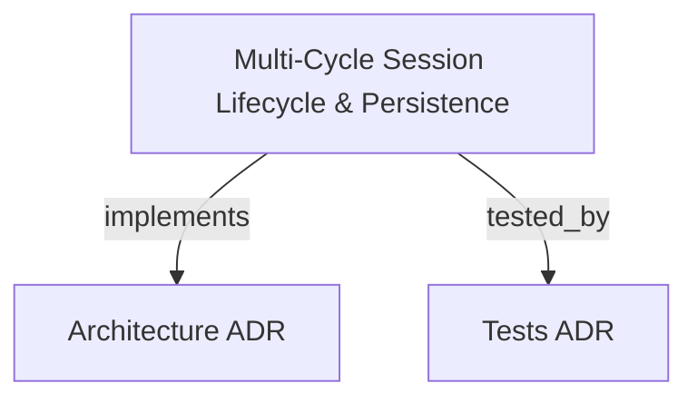

# Multi-Cycle Session Lifecycle & Persistence

Manages unique session identity, autonomous cycle collections, immutable phase snapshots, and atomic disk persistence with supervised process tree execution.

```graph
{
  "node_id": "feature:session-cycle-management",
  "domain": "session_cycle_management",
  "implements": ["adr:architecture"],
  "tested_by": ["adr:tests"],
  "entrypoints": [
    "sdk/src/server/adapters/inbound/http/routes/SessionCycleRoutes.ts"
  ],
  "registration_files": [
    "sdk/src/server/domain/value-objects/index.ts",
    "sdk/src/server/domain/aggregates/index.ts"
  ],
  "reference_files": [
    "sdk/src/server/application/use-cases/CreateCycleSessionUseCase.ts"
  ],
  "code_files": [
    "sdk/src/server/domain/value-objects/SessionId.ts",
    "sdk/src/server/domain/value-objects/CycleId.ts",
    "sdk/src/server/domain/value-objects/CycleState.ts",
    "sdk/src/server/domain/entities/PhaseSnapshot.ts",
    "sdk/src/server/domain/aggregates/AutonomousCycle.ts",
    "sdk/src/server/domain/aggregates/Session.ts",
    "sdk/src/server/domain/repositories/ISessionRepository.ts",
    "sdk/src/server/adapters/outbound/persistence/FileSessionRepository.ts",
    "sdk/src/server/adapters/outbound/services/ProcessTreeManager.ts",
    "sdk/src/server/adapters/outbound/services/JobExecutionController.ts",
    "sdk/src/server/application/use-cases/ResumeCycleUseCase.ts",
    "sdk/src/server/application/use-cases/AbortCycleUseCase.ts",
    "sdk/src/server/adapters/inbound/http/dto/SessionCycleDto.ts"
  ],
  "test_files": [
    "sdk/src/server/domain/value-objects/__tests__/SessionId.spec.ts",
    "sdk/src/server/domain/aggregates/__tests__/AutonomousCycle.spec.ts",
    "sdk/src/server/adapters/outbound/persistence/__tests__/FileSessionRepository.spec.ts",
    "sdk/src/server/adapters/outbound/services/__tests__/ProcessTreeManager.spec.ts",
    "sdk/src/server/application/use-cases/__tests__/CycleSessionUseCases.spec.ts",
    "sdk/src/server/adapters/inbound/http/routes/__tests__/SessionCycleRoutes.spec.ts"
  ]
}
```

## OVERVIEW

The Session Cycle Management module coordinates the end-to-end lifecycle of autonomous execution cycles. It enforces domain invariants on cycle state transitions, records immutable phase snapshots, atomically persists manifests on disk under `.harness/sessions/<session-id>/`, and supervises child CLI runners via OS-level process trees.

## FOLDER STRUCTURE

<folder_structure>
```
sdk/src/server/
├── domain/
│   ├── value-objects/      # SessionId, CycleId, CycleState
│   ├── entities/           # PhaseSnapshot
│   ├── aggregates/         # AutonomousCycle, Session
│   └── repositories/       # ISessionRepository port
├── application/
│   └── use-cases/          # CreateCycleSession, ResumeCycle, AbortCycle
└── adapters/
    ├── inbound/http/       # SessionCycleRoutes, DTOs, SSE event streaming
    └── outbound/           # FileSessionRepository, ProcessTreeManager
```
</folder_structure>

## MAIN CONCEPTS & COMPONENTS

- **Session**: Aggregate root encapsulating workspace path and a collection of autonomous cycles sharing a common identity.
- **AutonomousCycle**: Aggregate root managing state progression (`INITIALIZED`, `RUNNING`, `COMPLETED`, `FAILED`, `ABORTED`) and phase snapshot ledgers.
- **PhaseSnapshot**: Immutable entity recording phase name, verdict, metadata, and recording timestamp.
- **FileSessionRepository**: Outbound persistence adapter performing atomic file writes using temporary file creation and atomic rename.
- **ProcessTreeManager**: Process supervision service filtering sensitive environment variables (`AWS_SECRET`, `TOKEN`, `PASSWORD`) and killing process trees recursively via `taskkill /t /f` or POSIX process groups.

## HOW TO USE SESSION CYCLE ROUTES

### Prerequisites
1. Local HTTP server mounted on `127.0.0.1`.
2. Workspace directory with read/write access for `.harness/sessions/`.

### Steps
1. Send `POST /api/sessions/cycles` with `{ workspacePath: string, sessionId?: string }` to initialize or attach a cycle.
2. Subscribe to `GET /api/sessions/cycles/events` via Server-Sent Events (SSE) to receive real-time phase updates.
3. Query `GET /api/sessions/:sessionId` to retrieve full session and cycle manifests.
4. Send `POST /api/sessions/cycles/resume` or `POST /api/sessions/cycles/abort` for cycle execution control.

<code_example>
# CORRECT: Resume cycle from last valid phase snapshot
POST /api/sessions/cycles/resume
{ "sessionId": "sess-uuid", "cycleId": "cycle-id", "fromPhase": "PHASE_A" }

# WRONG: Passing bare unvalidated session IDs without prefix
POST /api/sessions/cycles
{ "sessionId": "invalid_id_without_prefix" }
</code_example>

## PARAMETERS / CONFIGURATIONS

| Name | Type | Required | Description | Default |
|------|------|----------|-------------|---------|
| workspacePath | string | Yes | Root path where `.harness/sessions/` is stored | — |
| sessionId | string | No | Optional existing session ID for attaching cycles (`sess-` prefix) | auto-generated |
| fromPhase | string | No | Starting phase when resuming an interrupted cycle | — |

## BEST PRACTICES

REQUIRED: Atomic Persistence — Always write manifests to temporary `.tmp` files before renaming to guarantee crash consistency.  
REQUIRED: Sensitive Env Filtering — Strip all token and credential environment keys prior to spawning subprocesses.  
FORBIDDEN: Single PID Kill — Never terminate a parent process directly without terminating the full process tree.

## DOCUMENT MAP



## REFERENCES

- [**ARCHITECTURE.md**](../adr/ARCHITECTURE.md): Architectural patterns, clean layers, and CLI runner interfaces.
- [**TESTS.md**](../adr/TESTS.md): Vitest test protocols and coverage requirements.
