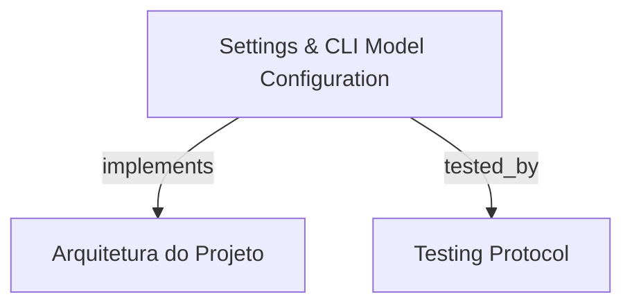

# Settings & CLI Model Configuration

Interface unificada e CLI declarativa/interativa para configuração, validação rigorosa e persistência atômica de modelos LLM e parâmetros de runners e fases de execução do HarnessKit.

```graph
{
  "node_id": "feature:settings-management",
  "domain": "cli_settings_models",
  "implements": ["adr:architecture"],
  "tested_by": ["adr:tests"],
  "entrypoints": [
    "sdk/src/cli/services/settings-service.ts",
    "sdk/src/settings/HarnessSettings.ts",
    "sdk-web/src/views/SettingsView.ts"
  ],
  "registration_files": [
    "sdk/src/server/application/use-cases/index.ts"
  ],
  "reference_files": [
    "sdk/src/settings/SettingsValidator.ts",
    "sdk/src/settings/AtomicSettingsWriter.ts",
    "sdk-web/src/hooks/useSettings.ts"
  ],
  "code_files": [
    "sdk/src/orchestrator/services/AgentInvocationService.ts",
    "sdk/src/server/application/ports/inbound/IGetSettingsUseCase.ts",
    "sdk/src/server/application/ports/inbound/IUpdateSettingsUseCase.ts",
    "sdk/src/server/application/use-cases/DeleteSettingsUseCase.ts",
    "sdk/src/server/application/use-cases/GetSettingsUseCase.ts",
    "sdk/src/server/application/use-cases/RenewSettingsUseCase.ts",
    "sdk/src/server/application/use-cases/UpdateSettingsUseCase.ts",
    "sdk/src/settings/DefaultSettings.ts",
    "sdk/src/settings/PathResolver.ts",
    "sdk/src/settings/SettingsSchema.ts",
    "sdk-web/src/components/settings/RawJsonEditor.ts",
    "sdk-web/src/components/settings/ScopeSelector.ts",
    "sdk-web/src/components/settings/SettingsConfirmModal.ts",
    "sdk-web/src/components/settings/SettingsFormEditor.ts",
    "sdk-web/src/services/SettingsApiClient.ts",
    "sdk-web/src/utils/settingsValidator.ts"
  ],
  "test_files": [
    "sdk/tests/unit/t16-settings.test.ts",
    "sdk/tests/unit/t17-orchestrator-settings.test.ts",
    "sdk/tests/unit/t28-harness-settings.test.ts",
    "sdk/src/server/application/use-cases/__tests__/SettingsUseCases.test.ts",
    "sdk-web/src/components/settings/__tests__/SettingsFormEditor.spec.ts",
    "sdk-web/src/hooks/__tests__/useSettings.spec.ts",
    "sdk-web/src/services/__tests__/SettingsApiClient.spec.ts",
    "sdk-web/src/views/__tests__/SettingsView.spec.ts"
  ]
}
```

## OVERVIEW
Permite inspecionar e alterar as configurações de execução do HarnessKit em escopos Local (`.harness-kit/settings.json`) e Global (`~/.config/harness-kit/settings.json`). Suporta resolução de fallback de dois níveis para modelos/effort por runner e fase, além de interfaces declarativa de terminal (`hrns settings set/get`), wizard interativo (`@inquirer/prompts`) e interface visual React.

## FOLDER STRUCTURE
<folder_structure>
```
sdk/src/
├── cli/services/                 # settings-service.ts (CLI declarativo e wizard interativo)
├── orchestrator/services/        # AgentInvocationService propagando modelos resolvidos
├── server/application/use-cases/ # GetSettings, UpdateSettings (patch deep merge), RenewSettings, DeleteSettings
└── settings/                     # HarnessSettings, SettingsValidator, AtomicSettingsWriter, SettingsSchema
sdk-web/src/
├── components/settings/          # ScopeSelector, SettingsFormEditor, RawJsonEditor e modais
├── hooks/                        # useSettings gerenciando estado e validação
├── services/                     # SettingsApiClient
└── views/                        # SettingsView
```
</folder_structure>

## KEY MECHANISMS

### Two-Tier Model & Effort Fallback Resolution
- **Prioridade de Resolução**: `Phase Override` > `Runner Default (defaultModel / defaultEffort)` > `Baseline Default`.
- **Propagação no Orquestrador**: `AgentInvocationService` resolve o modelo e nível de raciocínio efetivo para cada despacho de subagente, garantindo defaults globais sem exigir configuração repetitiva por fase.

### Sanitization & Strict Whitelist Validation
- **Validação de Modelo**: Regex estrita `^[a-zA-Z0-9][a-zA-Z0-9._:/-]{0,127}$` bloqueia metacaracteres de shell (`;`, `&`, `|`, `$`) e prefixos de flags leading (`--`), prevenindo injeção de argumentos nos processos filhos.
- **Níveis de Effort**: Restrito aos enums suportados (`low`, `medium`, `high`, `xhigh`).

### Declarative CLI & Interactive Wizard
- **Comandos Declarativos**: `hrns settings set <runner> [--model <model>] [--effort <effort>] [--phase <phase>] [--scope local|global] [--json]` para automação CI/CD e scripting.
- **Wizard Interativo**: `hrns settings edit` apresenta menus guiados para seleção de escopo, runner, modelo padrão e overrides de fase.

### Patch-Based Deep Merging & Atomic Disk Persistence
- **Merge Seguro**: `UpdateSettingsUseCase` aplica patches parciais preservando timeouts existentes, fases não modificadas e outros runners.
- **Gravação Atômica**: `AtomicSettingsWriter` realiza escrita em arquivo temporário com rename atômico.

## HOW TO CONFIGURE AND DISPATCH

### Prerequisites
1. Permissões de escrita no diretório do projeto ou diretório global.
2. Binários dos runners instalados ou configurados no ambiente.

### Steps
1. Executar o comando CLI ou abrir o dashboard de configurações na web.
2. Definir o modelo padrão do runner ou sobrescrever fases específicas.

<code_example>
# CORRECT: Configuração declarativa via CLI
hrns settings set antigravity --model gemini-3.7-flash --effort high --scope local

# WRONG: Escrita manual sem sanitização de caracteres
echo '{"antigravity":{"defaultModel":"gpt; rm -rf /"}}' > .harness-kit/settings.json # WRONG: risco de injeção
</code_example>

## PARAMETERS / CONFIGURATIONS

| Parameter | Type | Required | Description | Default |
|-----------|------|----------|-------------|---------|
| `defaultModel` | string | No | Modelo padrão global para o runner (regex sanitizado) | — |
| `defaultEffort` | EffortLevel | No | Nível de esforço/raciocínio padrão (`low`, `medium`, `high`, `xhigh`) | — |
| `timeoutMs` | number | No | Timeout da fase ou runner em milissegundos | 1800000 |
| `phases` | Record<string, PhaseSettings> | No | Mapa de overrides específicos por fase | {} |

## BEST PRACTICES
REQUIRED: Usar `SettingsValidator.validate` antes de qualquer persistência em disco.
REQUIRED: Usar `AtomicSettingsWriter` para garantir integridade contra corrupção em falhas de processo.
FORBIDDEN: Passar nomes de modelos não sanitizados diretamente para flags de subprocessos.

## DOCUMENT MAP



## REFERENCES

- [**ARCHITECTURE.md**](../adr/ARCHITECTURE.md): Estrutura Clean Architecture e resolução de dependências.
- [**TESTS.md**](../adr/TESTS.md): Testes unitários e de integração herméticos com Vitest.
