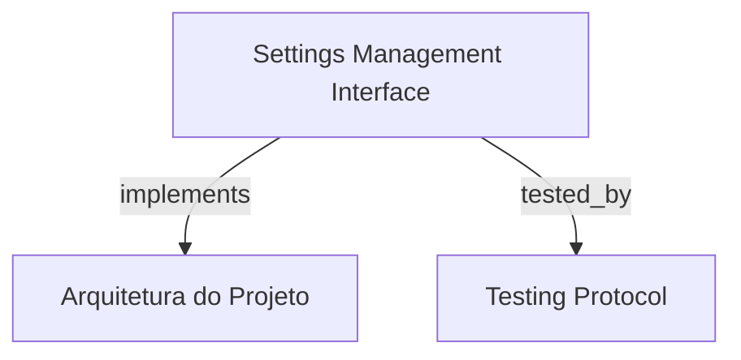

# Settings Management Interface

Interface de gerenciamento de configurações do HarnessKit Web, espelhando o comando `hrns settings` para visualização, edição em modo duplo (formulário visual e JSON bruto), renovação e validação de arquivos `settings.json` globais e locais.

```graph
{
  "node_id": "feature:settings-management",
  "domain": "settings_management",
  "implements": ["adr:architecture"],
  "tested_by": ["adr:tests"],
  "entrypoints": [
    "sdk-web/src/views/SettingsView.ts",
    "sdk/src/settings/HarnessSettings.ts"
  ],
  "registration_files": [
    "sdk/src/server/application/use-cases/index.ts"
  ],
  "reference_files": [
    "sdk-web/src/hooks/useSettings.ts",
    "sdk/src/settings/AtomicSettingsWriter.ts"
  ],
  "code_files": [
    "sdk-web/src/components/settings/RawJsonEditor.ts",
    "sdk-web/src/components/settings/ScopeSelector.ts",
    "sdk-web/src/components/settings/SettingsConfirmModal.ts",
    "sdk-web/src/components/settings/SettingsFormEditor.ts",
    "sdk-web/src/services/SettingsApiClient.ts",
    "sdk-web/src/utils/settingsValidator.ts",
    "sdk/src/server/application/ports/inbound/IGetSettingsUseCase.ts",
    "sdk/src/server/application/ports/inbound/IUpdateSettingsUseCase.ts",
    "sdk/src/server/application/use-cases/DeleteSettingsUseCase.ts",
    "sdk/src/server/application/use-cases/GetSettingsUseCase.ts",
    "sdk/src/server/application/use-cases/RenewSettingsUseCase.ts",
    "sdk/src/server/application/use-cases/UpdateSettingsUseCase.ts",
    "sdk/src/settings/PathResolver.ts",
    "sdk/src/settings/SettingsValidator.ts"
  ],
  "test_files": [
    "sdk-web/src/components/settings/__tests__/SettingsFormEditor.spec.ts",
    "sdk-web/src/hooks/__tests__/useSettings.spec.ts",
    "sdk-web/src/services/__tests__/SettingsApiClient.spec.ts",
    "sdk-web/src/views/__tests__/SettingsView.spec.ts",
    "sdk/src/server/application/use-cases/__tests__/SettingsUseCases.test.ts"
  ]
}
```

## OVERVIEW
Permite inspecionar e alterar as configurações de execução do HarnessKit em níveis Local (`.harness-kit/settings.json`) e Global (`~/.config/harness-kit/settings.json`). Fornece alternância transparente entre formulário reativo e editor de JSON com validação instantânea de schema e persistência atômica segura contra corrupção de disco.

## FOLDER STRUCTURE
<folder_structure>
```
sdk-web/src/
├── components/settings/          # ScopeSelector, SettingsFormEditor, RawJsonEditor e Modais
├── hooks/                        # useSettings gerenciando estado e validação
├── services/                     # SettingsApiClient
└── views/                        # SettingsView
sdk/src/
├── server/application/use-cases/ # GetSettings, UpdateSettings, RenewSettings, DeleteSettings
└── settings/                     # AtomicSettingsWriter, PathResolver, SettingsValidator
```
</folder_structure>

## KEY MECHANISMS

### Dual Edit Modes & Real-Time Validation
- **Formulário Visual e Raw JSON**: Permite alternar entre edição estruturada por campos (runners, timeouts, fases, modelos) e edição direta do código JSON sem perder dados.
- **Validação de Schema**: Garante timeouts positivos (`timeoutMs > 0`), chaves de runners válidas e tipagem estrita de fases antes da submissão.

### Precedence Hierarchy & Scope Resolution
- **Hierarquia de Precedência**: Aplica a ordem de resolução Canônica: Local (`.harness-kit/settings.json`) > Global (`~/.config/harness-kit/settings.json`) > Defaults embutidos.

### Atomic Filesystem Persistence
- **Gravação Segura**: `AtomicSettingsWriter` utiliza arquivo temporário intermediário e rename atômico para evitar arquivos truncados ou corrupções em caso de interrupção inesperada.

## HOW TO CONFIGURE AND DISPATCH

### Prerequisites
1. Permissões de leitura/escrita no escopo desejado (workspace local ou home global).
2. Endpoints de configurações do SDK ativos.

### Steps
1. Selecionar o escopo desejado (Local ou Global) no `ScopeSelector`.
2. Modificar as opções no formulário ou JSON bruto e clicar em Salvar.

<code_example>
# CORRECT: Gravação atômica com validação de payload
const validated = SettingsValidator.validate(payload);
await AtomicSettingsWriter.write(targetPath, validated);

# WRONG: Escrita direta síncrona sem validação de schema
fs.writeFileSync(targetPath, JSON.stringify(rawInput)); // WRONG: risco de corromper settings com JSON inválido
</code_example>

## PARAMETERS / CONFIGURATIONS

| Parameter | Type | Required | Description | Default |
|-----------|------|----------|-------------|---------|
| `scope` | 'local' | 'global' | Yes | Escopo de destino do arquivo de configuração | 'local' |
| `settings` | HarnessSettingsMap | Yes | Mapa estruturado de configurações | {} |
| `workspacePath` | string | No | Caminho do workspace quando escopo for local | process.cwd() |

## BEST PRACTICES
REQUIRED: Usar `AtomicSettingsWriter` para todas as mutações em arquivos de settings.
REQUIRED: Validar schema e valores numéricos positivos antes de persistir em disco.
FORBIDDEN: Permitir que erros de formatação no editor JSON sobrescrevam arquivos válidos.

## DOCUMENT MAP



## REFERENCES

- [**ARCHITECTURE.md**](../adr/ARCHITECTURE.md): Estratégia de resolução de dependências e configurações.
- [**TESTS.md**](../adr/TESTS.md): Testes de use cases de configurações e validação atômica.
