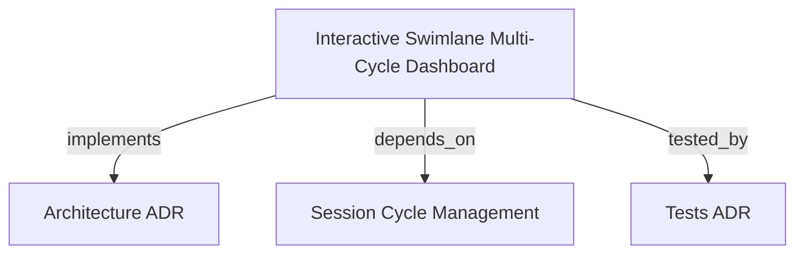

# Interactive Swimlane Multi-Cycle Dashboard

Provides a visual timeline interface with horizontal time scale, category/runner lanes, interactive cycle cards with real-time status updates, and session selection controls.

```graph
{
  "node_id": "feature:swimlane-cycle-dashboard",
  "domain": "swimlane_cycle_dashboard",
  "implements": ["adr:architecture"],
  "tested_by": ["adr:tests"],
  "entrypoints": [
    "sdk-web/src/views/orchestrator/SwimlaneDashboardView.ts"
  ],
  "registration_files": [
    "sdk-web/src/styles/swimlane.tokens.css"
  ],
  "reference_files": [
    "sdk-web/src/views/orchestrator/components/CycleCard.ts"
  ],
  "code_files": [
    "sdk-web/src/styles/swimlane.module.css",
    "sdk-web/src/utils/timeScaleUtils.ts",
    "sdk-web/src/views/orchestrator/components/TimeScaleHeader.ts",
    "sdk-web/src/views/orchestrator/components/CategoryLane.ts",
    "sdk-web/src/views/orchestrator/components/SessionSelector.ts",
    "sdk-web/src/views/orchestrator/components/CycleDetailDrawer.ts",
    "sdk-web/src/views/orchestrator/components/CategoryFilterBar.ts",
    "sdk-web/src/services/SwimlaneApiClient.ts",
    "sdk-web/src/hooks/useSwimlaneDashboard.ts"
  ],
  "test_files": [
    "sdk-web/src/styles/__tests__/swimlaneContrast.spec.ts",
    "sdk-web/src/views/orchestrator/components/__tests__/TimeScaleHeader.spec.ts",
    "sdk-web/src/views/orchestrator/components/__tests__/CategoryLane.spec.ts",
    "sdk-web/src/views/orchestrator/components/__tests__/CycleDetailDrawer.spec.ts",
    "sdk-web/src/services/__tests__/SwimlaneApiClient.spec.ts",
    "sdk-web/src/hooks/__tests__/useSwimlaneDashboard.spec.ts",
    "sdk-web/src/views/orchestrator/__tests__/SwimlaneDashboardView.spec.ts"
  ]
}
```

## OVERVIEW

The Swimlane Multi-Cycle Dashboard provides operators with visual observability and control over concurrent autonomous cycles. It projects execution durations onto synchronized horizontal tracks, categorizes cycles by runner domain, displays live status badges via SSE stream consumption, and offers an inspection drawer for deep phase telemetry and action triggers.

## FOLDER STRUCTURE

<folder_structure>
```
sdk-web/src/
├── styles/                 # swimlane.tokens.css, swimlane.module.css
├── utils/                  # timeScaleUtils (coordinate calculation & zoom)
├── services/               # SwimlaneApiClient (REST endpoints)
├── hooks/                  # useSwimlaneDashboard (controller & SSE listener)
└── views/orchestrator/
    ├── SwimlaneDashboardView.ts # Main composite canvas view
    └── components/         # TimeScaleHeader, CategoryLane, CycleCard, Drawer, Selector
```
</folder_structure>

## MAIN CONCEPTS & COMPONENTS

- **TimeScaleHeader**: Sticky horizontal ruler projecting temporal markers across configurable zoom levels (`1m`, `5m`, `15m`, `1h`).
- **CategoryLane**: Horizontal swimlane grouping cycle cards by category (e.g. backend, frontend, qa) with item count badges.
- **CycleCard**: Interactive visual block whose pixel width and horizontal offset correspond to cycle start and end times.
- **CycleDetailDrawer**: Expanding side sheet displaying phase snapshots, recorded verdicts, and lifecycle action controls (Resume / Abort).
- **SessionSelector & CategoryFilterBar**: Top bar controls for switching between workspace sessions and isolating specific agent categories without shifting the temporal grid.

## HOW TO RENDER SWIMLANE DASHBOARD

### Prerequisites
1. Backend HTTP/SSE server running on `127.0.0.1:4000`.
2. Initialized workspace with active or persisted session manifests.

### Steps
1. Instantiate `SwimlaneApiClient` and `SwimlaneDashboardController`.
2. Load active session via `controller.loadSession(sessionId)`.
3. Instantiate and render `SwimlaneDashboardView` with the controller.

<code_example>
# CORRECT: Render dashboard using declarative view controller
const controller = new SwimlaneDashboardController({ apiClient })
await controller.loadSession('sess-100')
const view = new SwimlaneDashboardView({ controller })
container.innerHTML = view.render()

# WRONG: Directly manipulating DOM elements without controller state sync
card.style.left = '300px' // Bypasses timeScaleUtils projection
</code_example>

## PARAMETERS / CONFIGURATIONS

| Name | Type | Required | Description | Default |
|------|------|----------|-------------|---------|
| pixelsPerSecond | number | No | Pixel-to-second ratio for timeline projection | 1 |
| zoomLevel | string | No | Ruler interval granularity (`1m`, `5m`, `15m`, `1h`, `auto`) | '15m' |
| categoryFilter | string | No | Filter pill selection ('ALL' or category name) | 'ALL' |

## BEST PRACTICES

REQUIRED: WCAG AA Contrast — All status badges and text must maintain >= 4.5:1 contrast against track backgrounds.  
REQUIRED: Pure Mathematical Projections — Calculate horizontal pixel offsets via `timeScaleUtils` pure functions to prevent layout thrashing.  
FORBIDDEN: Heavy Inline Logs — Avoid rendering full raw terminal logs inside unexpanded cards; load detailed snapshots on-demand in the drawer.

## DOCUMENT MAP



## REFERENCES

- [**ARCHITECTURE.md**](../adr/ARCHITECTURE.md): Frontend view composition and theme token architecture.
- [**session-cycle-management.md**](./session-cycle-management.md): Upstream backend session and cycle persistence.
- [**TESTS.md**](../adr/TESTS.md): Vitest component and hook integration test standards.
