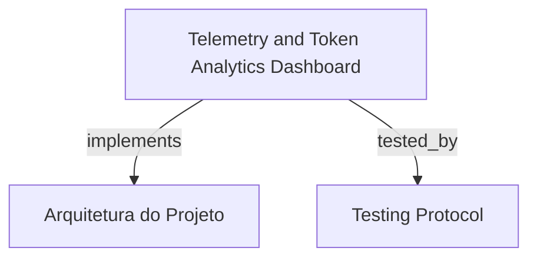

# Telemetry and Token Analytics Dashboard

Painel analítico de telemetria e consumo de tokens para o HarnessKit Web (espelhando `hrns report`), apresentando detalhamento multidimensional de custos por skill, fase e modelo, economia de prompt caching e exportação de trilha de auditoria em CSV/JSON.

```graph
{
  "node_id": "feature:telemetry-analytics",
  "domain": "telemetry_analytics",
  "implements": ["adr:architecture"],
  "tested_by": ["adr:tests"],
  "entrypoints": [
    "sdk-web/src/views/TelemetryDashboardView.ts",
    "sdk-web/src/server/controllers/ReportController.ts"
  ],
  "registration_files": [
    "sdk-web/src/server/routes/reportRoutes.ts",
    "sdk-web/src/server/routes/report.routes.ts"
  ],
  "reference_files": [
    "sdk-web/src/hooks/useTelemetryReport.ts",
    "sdk-web/src/types/telemetry.ts"
  ],
  "code_files": [
    "sdk-web/src/components/telemetry/AuditTrailTable.ts",
    "sdk-web/src/components/telemetry/BacklogHealthWidget.ts",
    "sdk-web/src/components/telemetry/CacheSavingsCard.ts",
    "sdk-web/src/components/telemetry/MetricsSummaryCards.ts",
    "sdk-web/src/components/telemetry/ModelCostDistributionChart.ts",
    "sdk-web/src/components/telemetry/SkillCostBreakdownTable.ts",
    "sdk-web/src/utils/telemetryExport.ts"
  ],
  "test_files": [
    "sdk-web/src/components/telemetry/__tests__/AuditTrailTable.spec.ts",
    "sdk-web/src/components/telemetry/__tests__/MetricsSummaryCards.spec.ts",
    "sdk-web/src/components/telemetry/__tests__/SkillCostBreakdownTable.spec.ts",
    "sdk-web/src/hooks/__tests__/useTelemetryReport.spec.ts",
    "sdk-web/src/server/__tests__/ReportController.spec.ts",
    "sdk-web/src/views/__tests__/TelemetryDashboardView.spec.ts"
  ]
}
```

## OVERVIEW
Consolida métricas financeiras e de performance dos agentes executados pelo HarnessKit. Processa o registro contínuo de tokens (`tokens.jsonl`) e expõe cards de resumo, gráficos de distribuição de custo por modelo, tabelas de consumo por skill e widgets de saúde do backlog com cálculo exato de economia gerada por cache.

## FOLDER STRUCTURE
<folder_structure>
```
sdk-web/src/
├── components/telemetry/         # Cards, gráficos e tabelas de detalhamento de custo
├── hooks/                        # useTelemetryReport
├── server/controllers/           # ReportController
├── server/routes/                # Rotas REST de relatórios
├── utils/                        # Exportação de relatórios (CSV / JSON)
└── views/                        # TelemetryDashboardView
```
</folder_structure>

## KEY MECHANISMS

### Multidimensional Cost & Token Breakdown
- **Mapeamento de Modelos**: Calcula custos com base em tabelas de preços por milhão de tokens (input, output, cache-read e cache-creation).
- **Matriz de Custo por Skill**: Apresenta a divisão exata de consumo entre personas (the-grumpy-tech-lead, adversarial-qa, etc.).

### Prompt Cache Savings Analysis
- **Economia Financeira**: Quantifica os dólares economizados devido a reaproveitamento de contexto em prompts com cache.

### Audit Trail & Data Export
- **Tabela Filtrável de Auditoria**: Lista eventos de invocação com filtros por modelo, agente e período.
- **Exportação Multiformato**: Permite baixar a trilha de telemetria completa nos formatos JSON e CSV.

## HOW TO CONFIGURE AND DISPATCH

### Prerequisites
1. Execuções prévias com registros em `tokens.jsonl`.
2. Servidor HTTP ativo servindo a rota `/api/reports`.

### Steps
1. Acessar a visão de Relatórios (`/reports`) no aplicativo web.
2. Aplicar filtros temporais ou de skill e exportar os dados se necessário.

<code_example>
# CORRECT: Obtenção de relatório consolidado de produto
const report = await fetch('/api/reports?workspacePath=' + encodeURIComponent(path)).then(r => r.json());
console.log('Total cost USD:', report.totalCostUsd);

# WRONG: Calcular preços de modelos em código client-side ad-hoc
const cost = tokens * 0.00001; // WRONG: ignora tiers de cache e variações de modelo
</code_example>

## PARAMETERS / CONFIGURATIONS

| Parameter | Type | Required | Description | Default |
|-----------|------|----------|-------------|---------|
| `workspacePath` | string | Yes | Diretório raiz do projeto inspecionado | process.cwd() |
| `format` | 'json' | 'csv' | No | Formato de exportação de dados de auditoria | 'json' |

## BEST PRACTICES
REQUIRED: Delegar cálculos de precificação e agregação de tokens à camada de backend.
REQUIRED: Tratar linhas corrompidas no ledger de tokens de forma resiliente sem interromper a agregação global.
FORBIDDEN: Expor credenciais ou prompts confidenciais nos payloads de exportação de telemetria.

## DOCUMENT MAP



## REFERENCES

- [**ARCHITECTURE.md**](../adr/ARCHITECTURE.md): Modelo de dados e agregação de telemetria.
- [**TESTS.md**](../adr/TESTS.md): Estratégia de testes de controladores de relatórios.
