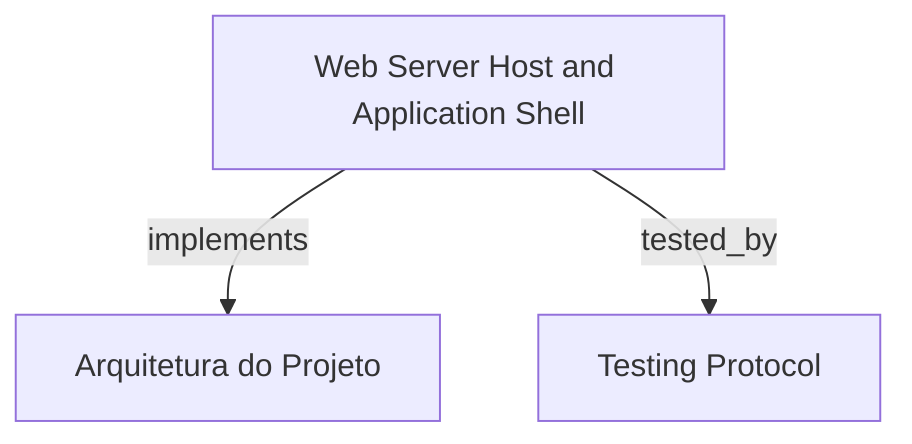

# Web Server Host and Application Shell

Application shell para o HarnessKit Web (`sdk-web`) com paleta de cores Itaú Unibanco (laranja `#EC7000` e azul marinho `#003399`), alternância persistente de tema claro/escuro via tokens CSS, prevenção de FOUC e navegação responsiva em desktop e mobile.

```graph
{
  "node_id": "feature:web-shell-theme",
  "domain": "web_shell_theme",
  "implements": ["adr:architecture"],
  "tested_by": ["adr:tests"],
  "entrypoints": [
    "sdk-web/src/index.ts",
    "sdk-web/src/server/WebServerHost.ts"
  ],
  "registration_files": [
    "sdk-web/src/routes/AppRoutes.ts"
  ],
  "reference_files": [
    "sdk-web/src/context/ThemeContext.ts",
    "sdk-web/src/components/layout/ApplicationShell.ts"
  ],
  "code_files": [
    "sdk-web/src/components/layout/ResponsiveSidebar.ts",
    "sdk-web/src/components/layout/WorkspaceHeader.ts",
    "sdk-web/src/hooks/useResponsiveSidebar.ts",
    "sdk-web/src/hooks/useTheme.ts",
    "sdk-web/src/server/StaticAssetServer.ts",
    "sdk-web/src/styles/contrast.ts",
    "sdk-web/src/types/index.ts"
  ],
  "test_files": [
    "sdk-web/src/components/layout/__tests__/ResponsiveSidebar.spec.ts",
    "sdk-web/src/components/layout/__tests__/WorkspaceHeader.spec.ts",
    "sdk-web/src/hooks/__tests__/useTheme.spec.ts",
    "sdk-web/src/server/__tests__/WebServerHost.spec.ts",
    "sdk-web/src/styles/__tests__/contrast.spec.ts"
  ]
}
```

## OVERVIEW
Implementa a casca visual e o servidor HTTP local (`127.0.0.1`) do `sdk-web`. Fornece a paleta oficial Itaú Unibanco com conformidade WCAG AA (contraste >= 4.5:1), persistência de tema no `localStorage` com sincronização multi-abas via `StorageEvent`, e navegação lateral adaptável com ponto de quebra em 768px.

## FOLDER STRUCTURE
<folder_structure>
```
sdk-web/src/
├── context/                      # Contexto e gerenciamento de estado de tema
├── hooks/                        # Hooks de tema e responsividade da sidebar
├── components/layout/            # ApplicationShell, WorkspaceHeader e ResponsiveSidebar
├── server/                       # WebServerHost e StaticAssetServer com fallback SPA
├── styles/                       # Definições de tokens Itaú e validação de contraste
└── types/                        # Contratos e tipos de navegação e tema
```
</folder_structure>

## KEY MECHANISMS

### Itaú Brand Theme Tokens & A11y Compliance
- **Paleta Oficial**: Mapeia laranja Itaú (`#EC7000`), azul marinho (`#003399`) e grafites para custom properties CSS no `:root` e `[data-theme='dark']`.
- **Conformidade WCAG AA**: Garante razão de contraste mínima de 4.5:1 entre superfícies e textos em ambos os temas através de testes automatizados com fórmula de luminância relativa.
- **Sincronização Multi-Aba**: Atualiza dinamicamente o atributo `data-theme` no `document.documentElement` e propaga alterações entre abas abertas via listener de `storage`.

### Application Shell & Responsive Navigation
- **Workspace Header**: Exibe metadados do workspace ativo, indicador de status e botão acessível de alternância de tema com atributos ARIA (`aria-label`, `aria-live`).
- **Sidebar Adaptativa**: Painel lateral fixo em resoluções desktop (>= 768px) que colapsa automaticamente para gaveta overlay com backdrop em telas menores.

### Localhost Web Server Host
- **Isolamento Local**: Vincula estritamente a `127.0.0.1` prevenindo exposição em interfaces públicas ou de rede local.
- **Fallback SPA & Segurança**: Serve arquivos estáticos com verificação rigorosa contra directory traversal (`..`) e redireciona rotas desconhecidas para `index.html`.

## HOW TO CONFIGURE AND DISPATCH

### Prerequisites
1. Pacote `@lfernandoss/hrns-web` compilado ou executado via Node.js runtime.
2. Diretório de assets estáticos acessível pelo host HTTP.

### Steps
1. Inicializar o `WebServerHost` na porta desejada em `127.0.0.1`.
2. Envolver a árvore de componentes no `ThemeProvider` para habilitar a alternância de tema.

<code_example>
# CORRECT: Inicialização segura de host localhost com fallback SPA
const host = new WebServerHost({ port: 3000, host: '127.0.0.1', staticDir: './public' });
await host.start();

# WRONG: Vincular servidor a interface aberta em 0.0.0.0
const host = new WebServerHost({ port: 3000, host: '0.0.0.0' }); // WRONG: expõe workspace local para a rede
</code_example>

## PARAMETERS / CONFIGURATIONS

| Parameter | Type | Required | Description | Default |
|-----------|------|----------|-------------|---------|
| `port` | number | No | Porta TCP local para inicialização do host web | 3000 |
| `host` | string | Yes | Endereço IP de binding local | '127.0.0.1' |
| `theme` | 'light' | 'dark' | No | Modo de tema padrão inicial | 'light' |
| `storageKey` | string | No | Chave de armazenamento no LocalStorage | 'harness_theme' |

## BEST PRACTICES
REQUIRED: Aplicar alternância de temas via CSS Custom Properties no elemento raiz sem forçar rerenderização desnecessária da árvore DOM.
REQUIRED: Manter razão de contraste mínima de 4.5:1 para todos os pares interativos nos modos claro e escuro.
FORBIDDEN: Expor o servidor web local em `0.0.0.0` ou ignorar sanitização de caminhos contra path traversal.

## DOCUMENT MAP



## REFERENCES

- [**ARCHITECTURE.md**](../adr/ARCHITECTURE.md): Arquitetura global do monorepo e módulos do SDK.
- [**TESTS.md**](../adr/TESTS.md): Estratégia de testes unitários e de contraste visual.
