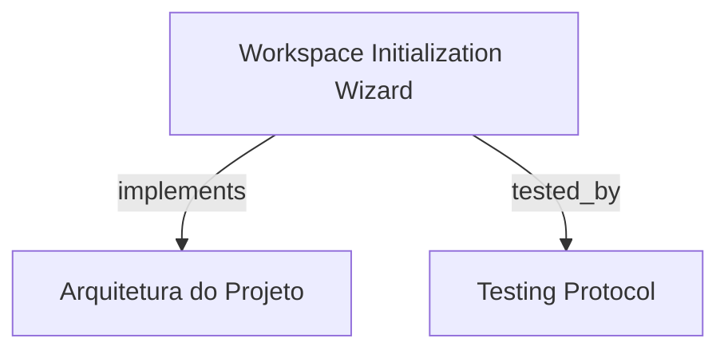

# Workspace Initialization Wizard

Assistente visual interativo para inicialização de workspaces no HarnessKit Web, espelhando o comando `hrns init` com inspeção de arquivos, geração atômica de documentos de tracking, editor de regras de steering e proteção contra sobrescrita acidental.

```graph
{
  "node_id": "feature:workspace-initialization",
  "domain": "workspace_initialization",
  "implements": ["adr:architecture"],
  "tested_by": ["adr:tests"],
  "entrypoints": [
    "sdk-web/src/pages/InitWizardPage.ts",
    "sdk/src/server/adapters/inbound/http/WorkspaceInitController.ts"
  ],
  "registration_files": [
    "sdk/src/server/application/use-cases/index.ts"
  ],
  "reference_files": [
    "sdk-web/src/hooks/useWorkspaceInit.ts",
    "sdk/src/server/application/use-cases/InitializeWorkspaceUseCase.ts"
  ],
  "code_files": [
    "sdk-web/src/components/init/InitStepper.ts",
    "sdk-web/src/components/init/OverwriteGuardDialog.ts",
    "sdk-web/src/components/init/SteeringRulesEditor.ts",
    "sdk-web/src/services/WorkspaceInitApiClient.ts",
    "sdk/src/server/adapters/inbound/http/dto/WorkspaceInitDto.ts",
    "sdk/src/server/application/use-cases/GetWorkspaceInitStatusUseCase.ts"
  ],
  "test_files": [
    "sdk-web/src/components/init/__tests__/OverwriteGuardDialog.spec.ts",
    "sdk-web/src/components/init/__tests__/SteeringRulesEditor.spec.ts",
    "sdk-web/src/hooks/__tests__/useWorkspaceInit.spec.ts",
    "sdk-web/src/pages/__tests__/InitWizardPage.spec.ts",
    "sdk/src/server/application/use-cases/__tests__/InitializeWorkspaceUseCase.spec.ts"
  ]
}
```

## OVERVIEW
Orquestra o onboarding e a preparação de repositórios para o loop autônomo de TDD. Provê um wizard em etapas na interface web e controladores REST no SDK para inspecionar a presença de `docs/product/`, gerar `BOOTSTRAP-CONFIG.json`, provisionar `.harness-kit/settings.json` e compilar diretivas de steering particionadas por fase.

## FOLDER STRUCTURE
<folder_structure>
```
sdk-web/src/
├── components/init/              # InitStepper, OverwriteGuardDialog e SteeringRulesEditor
├── hooks/                        # useWorkspaceInit gerenciando estado do wizard
├── pages/                        # InitWizardPage
└── services/                     # WorkspaceInitApiClient
sdk/src/server/
├── adapters/inbound/http/        # WorkspaceInitController e DTOs de inicialização
└── application/use-cases/        # InitializeWorkspaceUseCase e GetWorkspaceInitStatusUseCase
```
</folder_structure>

## KEY MECHANISMS

### Pre-Flight Inspection & Overwrite Guard
- **Detecção de Estado**: O endpoint `/api/init/status` inspeciona o diretório alvo e relata se já existem arquivos de tracking ou configurações prévias.
- **Proteção contra Sobrescrita**: Exige consentimento explícito (`force: true`) via `OverwriteGuardDialog` antes de reescrever ou limpar arquivos existentes em `docs/product/`.

### Phase-Partitioned Steering Editor
- **Governança de Fases**: Permite configurar e customizar regras de steering para cada fase do ciclo de vida (`user`, `bootstrap`, `planning`, `implementation`, `review`, `memory`).
- **Mesclagem com Padrões**: Combina dinamicamente as diretivas inseridas pelo usuário com as regras base do HarnessKit.

### Atomic Workspace Provisioning
- **Geração Atômica**: Inicializa a estrutura `docs/product/` (`DEVELOPMENT-STATE.md`, `ROADMAP.md`, `REQUIREMENTS.md`, `BACKLOG.md`) e `BOOTSTRAP-CONFIG.json` garantindo atomicidade na gravação.

## HOW TO CONFIGURE AND DISPATCH

### Prerequisites
1. Servidor de API do SDK ativo e escutando requisições locais.
2. Permissões de escrita no diretório do workspace de destino.

### Steps
1. Inspecionar o workspace através de `GetWorkspaceInitStatusUseCase` ou via `WorkspaceInitApiClient`.
2. Submeter os parâmetros de inicialização e regras de steering através do endpoint `/api/init`.

<code_example>
# CORRECT: Inicialização com validação prévia e guard de sobrescrita
const status = await apiClient.getStatus(workspacePath);
if (status.hasExistingFiles && !userConfirmed) {
  // Exibir diálogo de proteção contra sobrescrita
}
await apiClient.initialize({ workspacePath, force: userConfirmed, steeringRules });

# WRONG: Sobrescrever arquivos sem confirmação ou verificação de integridade
await fs.rm(workspaceDocsPath, { recursive: true }); // WRONG: risco de perda irreversível de tracking
</code_example>

## PARAMETERS / CONFIGURATIONS

| Parameter | Type | Required | Description | Default |
|-----------|------|----------|-------------|---------|
| `workspacePath` | string | Yes | Caminho absoluto do diretório raiz do projeto | process.cwd() |
| `force` | boolean | No | Flag para sobrescrever arquivos de tracking existentes | false |
| `steeringRules` | Record<string, string[]> | No | Mapa de diretivas customizadas por fase | {} |

## BEST PRACTICES
REQUIRED: Sempre verificar a existência prévia de `docs/product/` antes de iniciar a gravação de arquivos de tracking.
REQUIRED: Manter validação estrita de caminhos impedindo path traversal fora do workspace do projeto.
FORBIDDEN: Inicializar workspaces sem gerar o documento `BOOTSTRAP-CONFIG.json` com a tipagem canônica de fases.

## DOCUMENT MAP



## REFERENCES

- [**ARCHITECTURE.md**](../adr/ARCHITECTURE.md): Padrões de use cases e Clean Architecture do servidor.
- [**TESTS.md**](../adr/TESTS.md): Estratégia de testes unitários do wizard e use cases de init.
